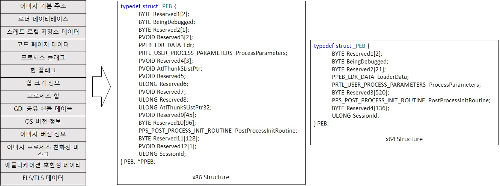

# PEB (Process Environment Block) 프로세스 환경 블록

PEB는 유저 모드에서 프로세스의 정보를 담고 있는 구조체로 유저 모드에서 접근할 필요가 있는   
이미지 로더와 힙 관리자, 다른 윈도우 컴포넌트들이 필요로 하는 정보를 포함하고 있습니다.  
따라서 PEB는 유저 모드에서 프로세스가 실행 될 때 마다 각각 하나씩 유저 모드 주소 공간에   
존재하기 때문에 자기 자신의 프로세스 컨텍스트에서만 유효합니다.  

  

PEB구조체는 그런데 OS가 출시 될 때마다 거의 변경되는데..   
MS에서 게을러지지 말라고 하는건지... 참 피곤하게 만드네요..  
그래도 위 PEB 구조체 정보에서 보면 몇가지 알아둬야 할 정보가 있는데 다음과 같습니다.  

## BYTE BeingDebugged   
현재 프로세스가 디버깅 중인지 여부를 확인할 수 있는데 보통은 사용하지 않을 뿐더러   
MSDN에서도 CheckRemoteDebuggerPresent() 함수를 사용하는게 가장 좋다고 합니다.  

## PPEB_LDR_DATA Ldr  
프로세스가 시작 할 때 로드 된 DLL에 대한 정보를 포함하는 PEB_LDR_DATA 구조체   
주소 값을 가지고 있으며, DLL 로딩 베이스 주소를 직접 구할 수 있습니다.  

## PRTL_USER_PROCESS_PARAMETERS ProcessParameters   
프로세스를 실행 할 때 전달 된 Command line과 프로세스 이미지 파일의 Path를 담고 있는 구조체로써   
보통 커널 모드에서 현재 실행 된 프로세스의 Full Path를 구할 때 참조하는 구조체 입니다.   
그런데 만약 프로세스가 실행 될 때 Short Path로 실행 하면.. 그 경로가 구해 집니다.  
따라서 실행 된 프로세스 이미지 파일의 Path 정보를 그대로 담고 있습니다.  
그리고.. 구조체 정보가 바뀌기 때문에 OS별로 각각의 PEB 구조체 사이즈를 구해서 OffSet을 계산해야 합니다.  

## ULONG SessionId  
현재 프로세스가 실행되고 있는 터미널 서비스 세션의 세션 ID 입니다.  

## 프로세스 힙(ProcessHeap)  
추가적으로 PEB 구조체에는 나와 있지 않지만 표에 보면 프로세스 힙(ProcessHeap)이 존재 하는데   
디버거 존재 여부를 확인하는데 쓰일 수 있는데, Anti-Debugging을 위해 이용되는 필드가 존재 한다고 합니다.  
하지만 지지고 볶고 하면 리버싱 할 때 우회 할 수 있다고 하는데 나중에 확인은 해봐야겠습니다.  

참고 문헌 : Windows Internals 및 MSDN
