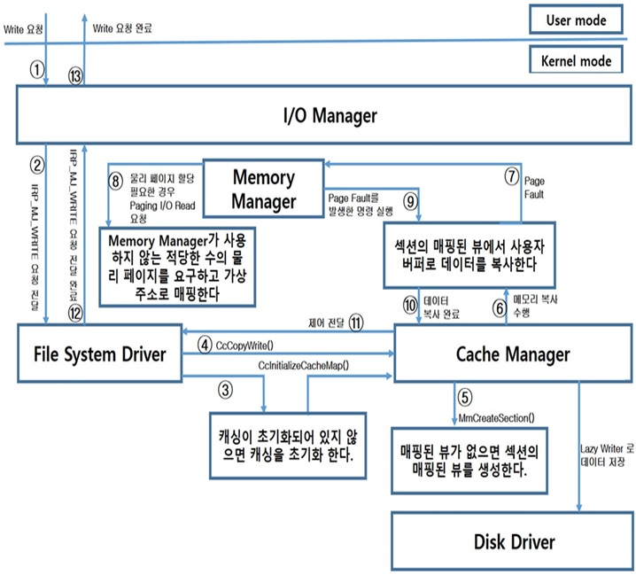

# Write Operation

애플리케이션에서 실제로 파일 쓰기를 요청 시도 시 커널에서 어떠한 과정을 거치면서  
디스크로 데이터가 기록되는지의 과정을 정리하려고 합니다.

  

1. 애플리케이션이 데이터 쓰기 요청 한다.   
1. I/O 매니져는 데이터 쓰기 동작에 대한 IRP 생성 후 파일 시스템 드라이버(File System Driver)에 전달 한다.   
1. FSD는 오픈 된 파일에 직접 데이터 저장을 지시한다.   
   이 때 데이터 저장을 실행하는 파일이 캐싱 되지 않았다면 캐시 매니져를 호출함으로써 파일을 캐싱 할 것을 지시 한다.  
1. FSD는 캐시 매니져에게 데이터 저장 요청 한다.  
1. 캐시 매니져는 데이터 구조 검사 및 사용자가 수정한 데이터 영역을 포함하는 파일에 대한 매핑 된 뷰가   
   어디에 있는지 결정 및 매핑 된 뷰가 없으면 생성 한다.   
1. 캐시 매니져가 메모리 복사를 수행, 이때 메모리 복사는 사용자 버퍼에서 파일의 매핑 된 뷰와 연관된 가상 주소 공간 으로 이루어진다.   
1. 가상 주소 영역이 물리 페이지와 연결되어 있지 않다면 페이지 폴트 발생 및 해결을 위해 메모리 매니져를 호출 한다.   
1. 메모리 매니져는 요청된 데이터를 저장하기 위해 사용될 물리 페이지를 할당,   
   사용자가 전체 페이지를 덮어 씌울 경우에는 캐시 매니져나 메모리 매니져가 데이터를 수정하기 전에 디스크와 분리되어   
   이미 물리 페이지에 있는 데이터를 읽지 않음. 그러나 일부 페이지가 수정되었다면 페이지의 수정이 허락되기 전에   
   메모리 매니져는 페이지 폴트(Page Fault)를 처리하기 위해 데이터 읽기를 위한 Paging I/O Read 요청을 발생한다.  
1. 페이지 폴트를 발생시켰던 명령을 다시 실행 한다.  
1. 사용자 데이터는 시스템 메모리에 있으며, 아직 저장 장치에 전달되지 않은 상태,  
   실질적인 저장 장치로의 저장은 캐시 매니져가 나중에 처리한다. (Lazy Writer에 의해서)   
1. 캐시 매니져가 데이터 저장 요청을 종료하고 FSD로 제어를 전달 한다.   
1. FSD는 I/O 매니져가 처음에 전달한 IRP를 종료 한다.   
1. I/O 매니져가 사용자 데이터 저장 요청을 완료 한다.   

참고 문헌 : Windows 구조와 원리  