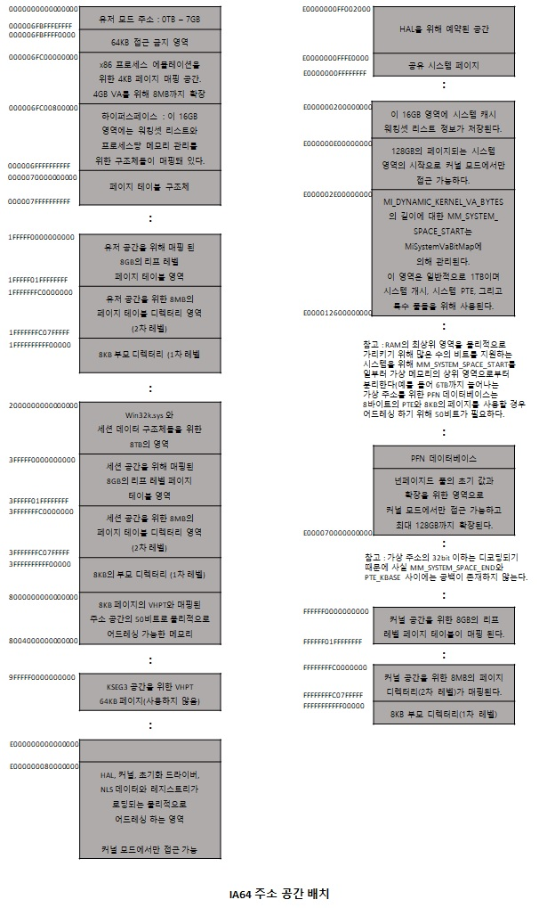
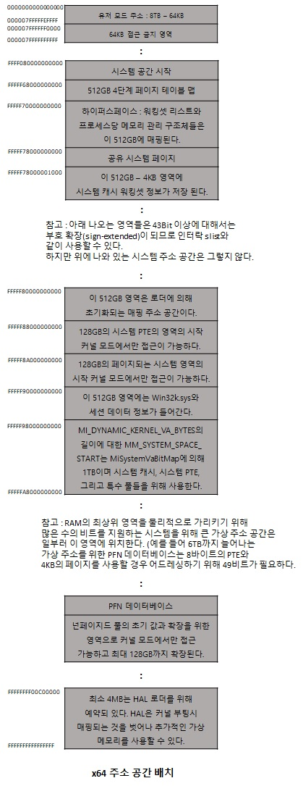

# x64 주소 공간 배치

32bit에서는 유저 영역에서 2GB 커널 영역에서 2GB 총 4GB의 가상 주소 공간 배치가 가능함으로써  
메모리 사용에 있어서 한계가 있었는데 반해 64bit에서는 16엑사바이트 가상 주소 공간을 사용할 수 있습니다.  
기존에 32bit에서는 유저 영역과 커널 영역 두 부분으로 나뉘어져 있는 반면에   
64bit 에서는 사용자, 시스템, 세션 공간과 개념적으로 매칭되는 다른 크기를 갖는 여러 영역으로 나눠집니다.  
그리고 64bit 에서는 큰 주소 공간을 인식하는 이미지가 가질 수 있는 또다른 유용한 특징으로   
64bit에서 동작하는 32bit 프로세스들은 4GB의 사용자 주소 공간을 사용할 수 있습니다.  
만약 32bit 프로세스가 3GB 포인터를 지원한다면 2GB에서 3GB로 변환할 필요 없이 4GB의 주소 공간을 사용할 수 있습니다.  

## 64bit 주소 공간 크기
|  
영역
 |  
IA64
 |  
x64
 | 
|:--------:|:--------:|:--------:|
|**
프로세스 주소 공간
** | *
7,152GB
* |*
8,192GB
* |
|**
시스템 PTE 공간
** | *
128GB
* |*
128GB
* |
|**
시스템 캐시
** |*
1TB
* |*
1TB
* |
|**
페이지드 풀
** | *
128GB
* |*
128GB
* |
|**
넌페이지드 풀
** |*
물리 메모리의 75%
* |*
물리 메모리의 75%
* |

  

  

64bit에서의 가상 주소 공간은 최대 16EB의 가상 메모리까지 사용할 수 있습니다.  
하지만 현재 256TB의 가상 주소 공간만을 구현하였는데 이것은 64bit 가상 주소의 하위 48bit만 구현 된 것입니다.  
하지만 가상 주소는 여전히 64bit 크기이고 메모리에 저장될 때나 레지스터에서 8바이트를 차지합니다.  
상위 16bit는 2의 보수 연산에서 부호 확장과 유사한 방법으로 가장 높은 47bit와 동일한 값을 가져야 하는데  
이런 규칙을 따르는 주소를 표준(canonical) 주소라고 합니다.  
이 규칙은 아래 주소 공간의 아래쪽 반은 0x0000000000000000으로 시작하고 0x00007FFFFFFFFFFF 로 끝나며,  
주소 공간의 위쪽 반은 0xFFFF800000000000 으로 시작해서 0xFFFFFFFFFFFFFFFF으로 끝납니다.  
하지만 현재 x64에서 동작하는 윈도우는 많은 제약이 있습니다.  
x64 프로세서에서는 256TB의 가상 주소 공간이 가용하지만 현재 윈도우에서는  
16TB보다 조금 많은 정도만 사용할 수 있어서 이 공간을 8TB의 두 영역으로 나뉘는데  
0부터 시작해서 그보다 높은 주소에서 동작하는 프로세스별 영역인  
유저 모드(0x0000000000000000~0x000007FFFFFFFFFF)와  
시스템 영역인 커널 모드(0xFFFF080000000000~0xFFFFF80000000000)가 있습니다.  

참고 문헌 : Windows Internals
